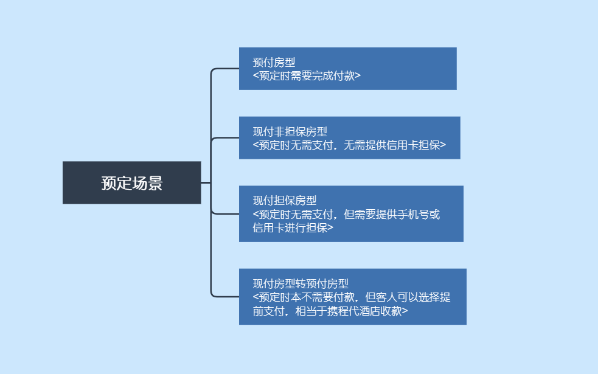
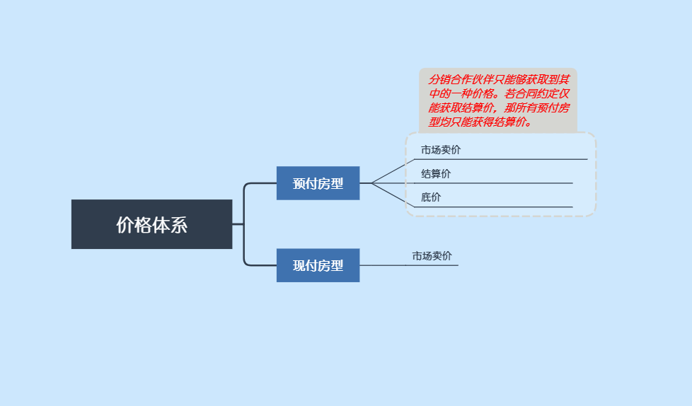
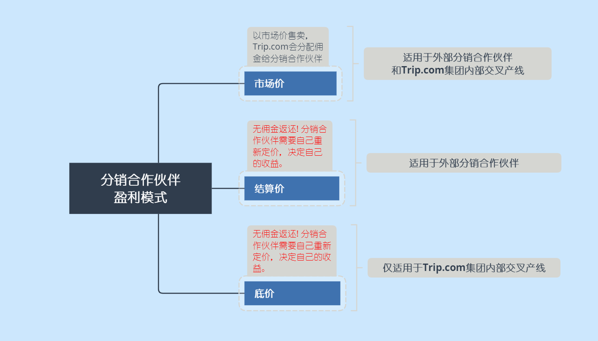

## TAP是谁?
TAP是Trip.com Affiliate Partnership（携程分销合作伙伴）的简称。我们是一家2003年在纳斯达克完成上市的中国公司，拥有3万余名员工和4亿注册会员，是世界领先的在线旅行公司。携程现有120多万国内外酒店，遍及全球200多个国家和地区，为全球客户提供全方位的旅行服务。

TPA作为沟通内外部的桥梁，帮忙外部合作平台及内部交叉的产线，获取携程酒店BU全量可分销酒店库存。我们的分销网络发展非常迅速，已经与国内外许多行业的头部公司建立了合作关系。同时，我们也与越来越多的中型企业紧密合作，用我们核心的酒店库存帮助这些企业成长。

TAP拥有非常专业的技术开发团队、产品经理团队、项目运营团队和商务合作团队。我们致力于持续优化现有产品方案，并不断寻找新的替代方案来满足客户多样化的需求。我们非常乐意聆听分销合作伙伴的声音，乐意与伙伴们一起成长。如果您有合作意向，可以点击[申请合作](https://dev.ctrip.com/#/cooperation/globalapply)，我们的商务经理会及时与您联系，沟通企业资质和合作的可能性。

## TAP如何运作?

TAP会给分销合作伙伴提供大批量的酒店库存。客人预订这些酒店时，要么需要提前付款，要么可以入住时付款。整体来说，客人预订都会落在这几类预定场景下。

TAP可以提供给分销合作伙伴不同类型的价格，诸如Trip.com市场卖价、Trip.com结算价、Trip.com底价。TAP具体给分销合作伙伴提供什么价格，取决于双方的商务协议。

分销合作伙伴获取什么类型的价格，直接决定了其如何进行盈利。下方图表详细介绍了不同类型价格下，分销合作伙伴应该如何盈利。

