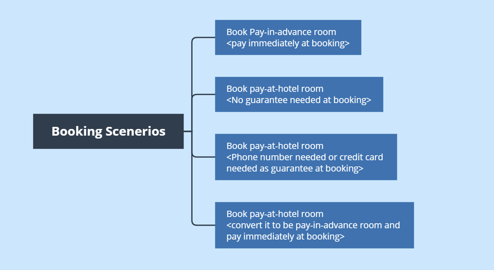
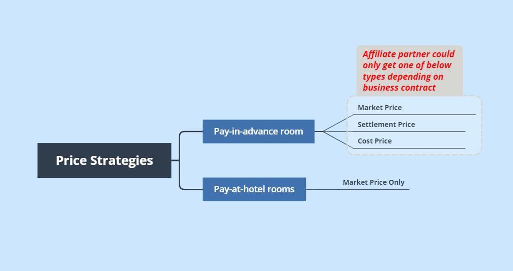
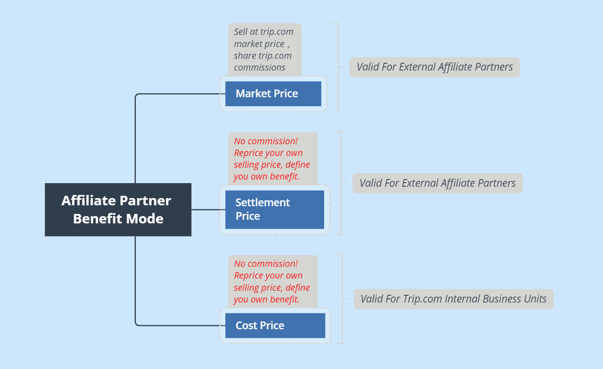

## Who is TAP?
TAP is short for Trip.com Affiliate Partnership. TAP works as the connector via which external affiliate partners could access Trip.com distributable hotels. Our network has been growing very fast in recent years with more and more industrial leading companies joining our network to explore new opportunities. We have also worked closely with midium-size companies to help boost their business with our competitive inventories.

TAP has its own dedicated product team and tech team endeavoring to optimize existing product solutions and explore new alternative choices for the diversified demands of its affiliate partners. We are always willing to hear voices of our affiliate partners and help them grow. If you have the interest to work with us, you could raise an application via [Apply to be affiliate partner](https://dev.ctrip.com/#/cooperation/globalapply). Our partnership managers will contact you for business details.

## How TAP works?

TAP provides massive distributable hotels to affiliate partners. Guests are either requested to pay in advance or pay at hotel. In general, guest bookings will fall into either of below booking scenarios.  

TAP provides multiple prices strageties when providing hotel inventories to its affiliate partners, depending on how the business contract is finalized. Currently, TAP supports three price strageties: market price, settlement price and cost price. Details are illustrated in below chart.  

Price strategies decide how affiliate partners will benenfit by selling Trip.com hotel inventories. Check below chart to learn what type of price you might get and how to benefit from each price type.

