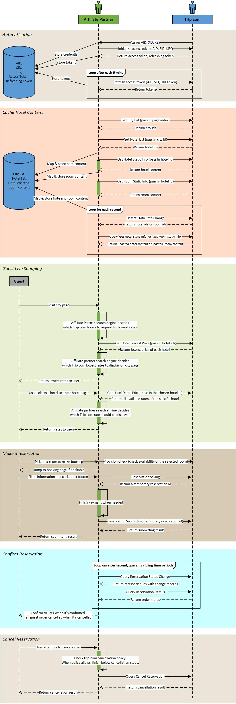
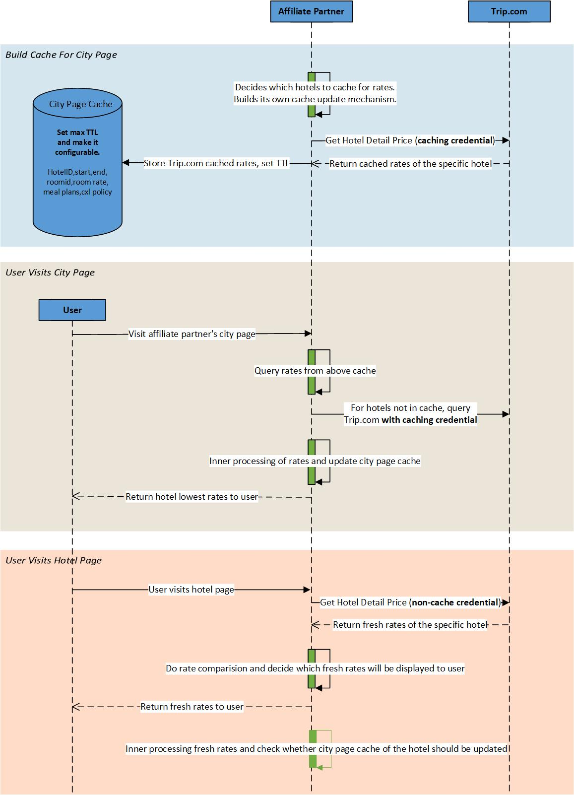

**Hotel direct booking** means your guests finish the booking within your own platform. You don't need to redirect your guests to Trip.com to finish the booking. This helps to improve final purchase conversion ratio. More details about Trip.com price strategies and how you could benefit are introduced in detail in chapter [How TAP works](#how-tap-works).

We have drafted one typical integration workflow to help you better understand how to make use of Trip.com APIs to finish the tech integration.

### 1. Could affiliate partner proactively cache Trip.com rates?
In above ***guest live shopping*** mode, an affiliate partner won't visit trip.com price APIs (`get hotel lowest price`, `get hotel detail price`) unless a real visitor is visiting an affiliate partner's web portals, h5 or mobile applications. Each request should be triggered by a real user visit.

If you only received one credentil, that credential is a `non-cache credential`. You could ony use that credential to fetch Trip.com real-time fresh rates when a real user visits your hotel page. ***This means you are forbideen to proactively caching Trip.com rates with that non-cache credential.***  If you proactively cache rates with that non-cache credential, it might cause serious system breakdown of our suppliers or direct-contract hotel, further leading them to disconnect with Trip.com. ***So don't go over the red line!***

### 2. How could affiliate partner proactively cache Trip.com rates?
If you really need to cache Trip.com rates, apply to Trip.com for a `caching credential`. A caching credential is used to synchronize Trip.com cached rates into your own system. ***Cached rates should only be used for city page purpose cause of its freshness***.

When a user visits your city page, you could calculate your own lowest price based on the cache. ***However, when a user visits you hotel page, you must trigger a real-time request with non-cache credential to Trip.com for real-time fresh rates.*** This suggestion must be followed, otherwise you might face rate availability and freshness issues on hotel page. The picture below briefly introduces how it works.

> ***Mind that lowest price from `Get Hotel Lowest Price` API is calculated by `market price`. If you cooperates with Trip.com on `settlement price` mode, you couldn't take lowest price from `Get Hotel Lowest Price`***. In this situation, you have two possible choices:  
> - When user visits your hotel page, you will enable a live request with non-cache crednetial to Trip.com API. Cache rates from its response and set a TTL (max 5 mins). As more users visit hotel page of different hotels, you will build more hotel caches. Caches could be used for city page usage if they aren't expired.  
> - Apply to Trip.com for an extra caching credential. synchronize Trip.com cached rates for your city page usage.

### 3. How to improve the availability and freshness of cached rates?
For cached rates, you are justing synchronizing Trip.com cached rates to your cache database. To make your cached rates as fresh as Trip.com cached rates, you gotta set up multiple cache update mechanisms. Below are some suggestions you could consider.   
- Set up a configurable TTL for each cache record. When cache expires, update it. Monitor cache availability between your city page and hotel page, this helps check availability of your cache. When cached rate availablility needs improvement, reduce TTL and test whether it works better.     
- When user visits your hotel page, you must trigger a real-time request with non-cache credential. Update your city page cache with its response. Rates in the response should be more fresh.     
- Exciting news is that Trip.com is planning to develop ***price change discovery*** for its cached rates. When Trip.com finishes the development, you could directly specify which Trip.com cached hotels you wanna monitor for price change. This might be the terminal solution which could help you minimize the difference between your cached rates and Trip.com cached rates.  
