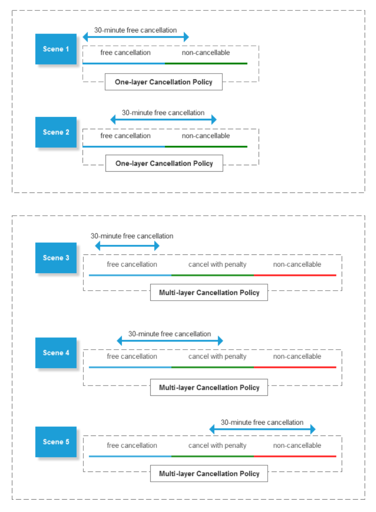

# Knowledge-Hub

## Pay-in-advance VS Pay-at-hotel <a name="pay-type"></a>
`Pay in advance` indicates guests must finish payment when they make reservations. This means you must collect payment from your guests on behalf of us. 

`Pay at hotel` indicates guests are not required to finish payment when making reservations. Instead, they will pay the hotel when they check in. This means you don't need to collect payment from your guests on behalf of us. This looks very flexible for guests. However, it has brought hotels in high risk of finalcial loss since guests could be of no-show at no cost. So some hotels have raised new requirements that reservations made on certain pay-at-hotel rooms must be reserved with guarantee (typically guaranteed by guests' credit cards). If guests don't check in as they have promised, certain credit lines will be deducted from guests' credit cards as penalty. Deduction could possibly be done by hotel itself or by us on behalf of the hotel depending on which specific room is reserved.

## Retail Price VS Settlement Price <a name="price-type"></a>
`Retail price` is the price at which we sell to our retail market. Retail price works for both `pay-in-advance rooms` and `pay-at-hotel rooms`. If we give you retail price only, you should also sell at our retail price. In this case, we will share hotel or supplier commissions with you. 

`Settlement price` is our cost price plus our profit margin. Settlement price only works for `pay-in-advance rooms`. When we give you settlement price for sale, you could either reprice it (if repricing allowed) or sell at our retail price (if repricing not allowed). In this case, we won't share hotel or supplier commissions with you. You decide your own profit margin.

**When you contract us, our account manager will finalize with you which model applies to the contract:**
Model 1: we only give you `retail price` for all sellable rooms (both pay-in-advance rooms and pay-at-hotel rooms). You should sell at our retail price for all sellable rooms.

Model 2: we give you `settlement price` for pay-in-advance rooms and give you `retail price` for pay-at-hotel rooms. You sell pay-in-advance rooms after your own repricing. You sell pay-at-hotel rooms at our retail price.


## Customized Currency VS Original Currency <a name="currency-type"></a>
Whenever we respond you certain amount (such as room rate, cancellation penalty, tax or fee amount), we will respond you amount both in `customized currency` and `original currency`. This is the basic thing to understand our APIs.

`Customized currency` actually equals the custmomized currency which you passed in request of each related API. Currently only `CNY` is supported. More language support is still under development.

`Original currency` is literally referring to the currency whereby we contract hotels or our suppliers. For reserving different types of rooms more easily, we have converted original currency internally to meet requirements made on currency type. For you, simply adopt our converted original currency to make reservations easily.


## How to pay for a new reservation? <a name="payment-flow"></a>
`Pay in advance`: As per our standard business model, we will set up a virtual credit account for each of your credential and assign certain credit lines for that account. **That virtual credit account only works for pay-in-advance reservations**. When a new reservation is made on a pay-in-advance sellable room, we will deduct credit lines equaling total order amount from that credit account. If there's no enough credit lines, making reservations on pay-in-advance rooms will fail absolutely. On your end, **you must collect payment from your guests at the time of booking a pay-in-advance room**. On our end, **we will do monthly financial settlement for your monthly reservations with your finance team**. Financial settlement details could be further discussed with our business account managers.

`Pay at hotel without guarantee`: If reservations are made on pay-at-hotel rooms which need no guarantee at all, then there's no need to provide any guarantee tool to make guarantee. Meanwhile, we won't deduct credit lines from your virtual credit account.

`Pay at hotel with guarantee`: If reservations are made on pay-at-hotel rooms which need guarantee, then certain guarantee tool **MUST** be provided as guarantee. We or hotel themselves will freeze or deduct guarantee amount from the guarantee tool. As you have proved to check in, guarantee amount will be refunded to your guarantee too. If guanratee tool is not provided, making reservations will fail absolutely.


## One-layer Cancellation Policy <a name="cancellation-policy"></a>
For this type of cancellation policy, we will respond you `maximumly one single datetime span` within length of stay. In this case, `Start` of the datetime span defines the final time point before which guests could cancel **confirmed reservations** free of charge. For this type of cancellation policy, any attempt to cancel **confirmed reservations** at and after that final time point will fail absolutely. 

**Example**

Start | End | Penalty | Description
---------|----------|---------|---------
 2019-09-05T04:00:00.000+02:00 |2019-09-06T00:00:00.000+02:00 | CNY 100 | 1. Confirmed reservation could be cancelled free of charge before 2019-09-05T04:00:00.000+02:00; 2. Confirmed reservation couldn't be cancelled at and after 2019-09-05T04:00:00.000+02:00; 3. If not cancelled and no show happened, then CNY 100 will be deducted as penalty.

> Mind that cancellation policy is basd on **China Beijing Time** by default. We could also help config it to be **hotel local time** upon your request.

> Mind that cancellation policy is the restriction for **confirmed reservations**. If a reservation isn't confirmed and isn't cancelled, guests could cancel it freely via **Cancel Reservation** API.


## Multi-layer Cancellation Policy
For this type of cancellation policy, we will respond you `two datetime spans` at least. Reservations could be cancelled free of charge before `Start` of `earliest datetime span`. Reservations could be cancelled with specified cancellation penalties during `earliest datetime span` and other datetime spans between the earliest one and latest one. Reservations couldn't be cancelled at and after `Start` of the `latest datetime span`. 

**Example 1**

Start | End | Penalty | Description
---------|----------|---------|---------
 2019-09-05T04:00:00.000+02:00 | 2019-09-06T15:00:00.000+02:00 |CNY 50 | 1. Confirmed reservation could be cancelled free of charge before 2019-09-05T04:00:00.000+02:00; 2. Confirmed reservation could be cancelled at penalty CNY 50 between 2019-09-05T04:00:00.000+02:00 and 2019-09-06T15:00:00.000+02:00.
2019-09-06T15:00:00.000+02:00 | 2019-09-07T00:00:00.000+02:00 | CNY 150 | 1. Confirmed reservation couldn't be cancelled at and after 2019-09-06T15:00:00.000+02:00; 2. If confirmed order wasn't cancelled and no show happened, then CNY 150 will be deducted from total order amount as penalty.

**Example 2**

Start | End | Penalty | Description
---------|----------|---------|---------
 2019-09-05T04:00:00.000+02:00 | 2019-09-06T15:00:00.000+02:00 | CNY 50 | 1. Confirmed reservation could be cancelled free of charge before 2019-09-05T04:00:00.000+02:00; 2. Confirmed reservation could be cancelled at penalty CNY 50 between 2019-09-05T04:00:00.000+02:00 and 2019-09-06T15:00:00.000+02:00.
2019-09-06T15:00:00.000+02:00 | 2019-09-07T18:00:00.000+02:00 | CNY 150 | 1. Confirmed reservation could be cancelled at penalty CNY 150 between 2019-09-06T15:00:00.000+02:00 and 2019-09-07T18:00:00.000+02:00.
2019-09-07T18:00:00.000+02:00 | 2019-09-08T00:00:00.000+02:00 | CNY 250 | 1. Confirmed reservation couldn't be cancelled at and after 2019-09-07T18:00:00.000+02:00; 2. If confirmed order wasn't cancelled and no show happened, then CNY 250 will be deducted from total order amount as penalty.


> Mind that cancellation policy is basd on **China Beijing Time** by default. We could also help config it to be **hotel local time** upon your request.

> Mind that cancellation policy is the restriction for **confirmed reservations**. If a reservation isn't confirmed and isn't cancelled, guests could cancel it freely via **Cancel Reservation** API.

## 30-minute Unconditional Cancellation Activity <a name="30-min-policy"></a>
We have initiated a cancellation related activity where hotels could register for participation. In this activity, hotels could claim that reservations made on certain rooms could be cancelled free of charge within 30 minutes after confirmation. If we enable this type of cancellation for your credentail, you could combine array `CancelPolicyInfos` with object `FreeCancelPolicyInfo` (if exists) to get a more relaxed cancellation policy. 

**Below picture introduces how to use them combinedly.**




## Guarantee Policy <a name="guarantee-policy"></a>
As we mentioned in discussion about [payment type](#pay-type), guests either need to pay in advance or pay at hotel. For `pay-in-advance` sellable rooms, guests have actuallly paid total amount for their reservation, part or all of the paid amount will be taken as the guarantee amount as defined by guarantee policy. For `pay-at-hotel` sellable rooms, when guests are requested to guarantee for their reservations, they need to pay guarantee amount (typically by credit cards) following the guarantee policy.

For either of above two cases, if guests are not allowed to cancel their reservations as per cancellation policy and guests won't check in, guarantee amount won't be refunded to guests. If there still exists left amount (only works for reservations made on pay-in-advance sellable rooms), we will refund to your virtual credit account directly, you further revert to your guests.

### How to calculate guarantee amount?
If we offer you `retail price` for sale, you could use guarantee amount which we have calculated and based on retail price in API. If we offer you `settlement price` for sale, you could only calculate guarantee amount based on our guarantee rules.

### Where to find daily room guarantee rules?
We define guarantee rules by assigning different guarantee types (parameter `GuaranteeCode`). Each sellable room has its own guarantee rule for each day. It indicates that daily guarantee rule of the same sellable room at different dates might be different. 

**All possible guarantee types are listed below.**

GuaranteeCode | GuaranteeTypeName | Description |
--------------|-------------------|--------------
1 | Peak-day guarantee | If certain days during length of stay is of this type, guests must guarantee for these specific days. Guarantee amount are room rates (multiple nights * all rooms) of these specific days.
2 | Full-amount guarantee | If one day during length of stay is of this type, guests must guarantee with full order amount (all nights * all rooms) for theire reservations regardless of guarantee types applied to other days.
3 | Over-time guarantee | If check-in date is of this type, guests must guarantee with first-night room rates (1 night * all rooms) if their estimated latest arrival time is at or after hotel hold time. **It only applies to pay-at-hotel rooms.**
4 | Always guarantee | If check-in date is of this type, guests must guarantee with first-night room rates (1 night * all rooms).
5 | Mobile-phone guarantee | If either day during length of stay is of this type, guests must provide mobile phone numbers when reserving these rooms.

### How to calculate overall guarantee amount of a reservation?
The overall guarantee amount of a new reservation is based on the combination of room daily guarantee rules. Priority difference of each guarantee type eventually decides what's the overall guarantee amount required for the new reservation.  Priority in descending order is: **full-amount guarantee > always guarantee = peak-day guarantee > over-time guarantee**.

**Example 1**

Examples | Daily Room Rate | Guarantee Type | Total Guarantee Amount
---------|----------|---------|-------------
Check in: 2019/11/10; Check out: 2019/11/14; Room quantity: 2 rooms; | 2019/11/10: CNY 100; 2019/11/11: CNY 120; 2019/11/12: CNY 140; 2019/11/12: CNY 160; | 2019/11/10 - GuaranteeCode: 5; 2019/11/11 - GuaranteeCode: 5; 2019/11/12 - GuaranteeCode: 5; 2019/11/13 - GuaranteeCode: 5; | No guarantee amount needed, but guests must provide mobile phone numbers when reserving the room.

**Example 2**

Examples | Daily Room Rate | Guarantee Type | Total Guarantee Amount
---------|----------|---------|-------------
Check in: 2019/11/10; Check out: 2019/11/14; Room quantity: 2 rooms; | 2019/11/10: CNY 100; 2019/11/11: CNY 120; 2019/11/12: CNY 140; 2019/11/12: CNY 160; | 2019/11/10 - GuaranteeCode: 1 2019/11/11 - GuaranteeCode: 4 2019/11/12 - GuaranteeCode: 1 2019/11/13 - GuaranteeCode: 4 | CNY 480 = (CNY 100 + CNY 140) * 2 rooms

**Example 3**

Examples | Daily Room Rate | Guarantee Type | Total Guarantee Amount
---------|----------|---------|-------------
Check in: 2019/11/10; Check out: 2019/11/14; Room quantity: 2 rooms; | 2019/11/10: CNY 100; 2019/11/11: CNY 120; 2019/11/12: CNY 140; 2019/11/12: CNY 160; | 2019/11/10 - GuaranteeCode: 4; 2019/11/11 - GuaranteeCode: 4; 2019/11/12 - GuaranteeCode: 1; 2019/11/13 - GuaranteeCode: 1; | CNY 800 = (CNY 100 + CNY 140 + CNY 160) * 2 rooms

**Example 4**

Examples | Daily Room Rate | Guarantee Type | Total Guarantee Amount
---------|----------|---------|-------------
Check in: 2019/11/10; Check out: 2019/11/14; Room quantity: 2 rooms; | 2019/11/10: CNY 100; 2019/11/11: CNY 120; 2019/11/12: CNY 140; 2019/11/12: CNY 160; | 2019/11/10 - GuaranteeCode: 3; 2019/11/11 - GuaranteeCode: 4; 2019/11/12 - GuaranteeCode: 3; 2019/11/13 - GuaranteeCode: 1; | If estimated latest arrival time is before hotel hold time,CNY 320 = (CNY 160) * 2 rooms; If estimated latest arrival time is at or later than hotel hold time,CNY 520 = (CNY 100 + CNY 160) * 2 rooms

**Example 5**

Examples | Daily Room Rate | Guarantee Type | Total Guarantee Amount
---------|----------|---------|-------------
Check in: 2019/11/10; Check out: 2019/11/14; Room quantity: 2 rooms; | 2019/11/10: CNY 100; 2019/11/11: CNY 120; 2019/11/12: CNY 140; 2019/11/12: CNY 160; | 2019/11/10 - GuaranteeCode: 1; 2019/11/11 - GuaranteeCode: 4; 2019/11/12 - GuaranteeCode: 2; 2019/11/13 - GuaranteeCode: 4; | CNY 1040 = (CNY 100 + CNY 120 + CNY 140 + CNY 160) * 2 rooms
                                                            |

## Fast Confirmed Rooms VS Non-fast Confirmed Rooms <a name="confirm-type"></a>
We identify fast-confirmed rooms following two possible ways. First way is that sellable rooms themselves are allotment rooms hotels have assigned for us (maybe for that we are good partners). Second way is that we calculate average confirmation time of the sellable room based on our massive historical reservations.

As per analysis of historical reservations, 93% of fast-confirmed rooms could be confirmed within 5 minutes. For non-fast confirmed rooms, we are not very sure when they will be confirmed, might be over one hour, even one or two days. It looks like non-fast confirmed room sucks completely. It doesn't suck at all! Our price analysis finds that a large portion of non-fast confirmed rooms have better rates. So we suggest you sell both fast-confirmed rooms and non-fast confirmed rooms. But it's still very necessary to give guests clear psychological expectations for the confirmation time.

For `fast-confirmed rooms`, we suggest you highlight them with some tips such as "reservations made on the room could be confirmed fast". For `Non-fast confirmed rooms`, we suggest you show some notification tips such as " this room has better rates, but it might take much longer time to get confirmed". 

For both `fast-confirmed rooms` and `Non-fast confirmed rooms`, you could set a maximum reservation-confirmation waiting time in your system. If we don't give you a final confirmation result within the maximum waiting time and you have decided not to wait for confirmation any more, then you `MUST` request our `Cancel Reservation` API to cancel it. Mind that you `MUST` identify whether cancellation is successful according to the response of the cancellation api. **You couldn't cancel reservations for geusts before we tell you cancellation is successful**. If we respond you cancellation failure, then the reservation might have been confirmed at that special moment of your cancellation request. In this case, we suggest you query `Read Reservation Details` API to double check whether it's confirmed. **Mind that you could only confirm your guests after you get confirmation from us**.


## Tax And Fee Rules <a name="tax-rules"></a>
If we contract you at retail price, then you could directly use tht tax and fee amounts we have calculated on each related API. However, if we contract you at settlement price and you need to display exact tax or fee amounts, then you need to calculate tax and fee amounts on your own based on tax & fee rules we have provided in `Get Room Static Info` API. To be continued...


## What's a cross-user? <a name="cross-user"></a>
`Cross user` is defined as a user who has records of reserving other products instead of properties. For example, a user who bought an airline ticket days ago is reserving a property now. He or she is a cross user in You must tell us whether a user is cross-user in each related API request. Otherwise, we won't respond you rates of these rooms and won't allow you guests to reserve those rooms which could only be reserved by cross-users.


## Name rules of guests <a name="guest-name"></a>

### 1.1 General guideline
We support either Chinese name or English name depending on geo location of the hotel.

For China hotels (excluding hotels in Hong Kong, Macao and Taiwan), guest names could be in both Chinese and English. Mind that You couldn’t combine Chinese letters with English characters for form a guest name. For example, `窦Robin` and `Robin 窦` are illegal names.

For international hotels (including hotels in Hong Kong, Macao, Taiwan and other countries), guest names could only be in English.

### 1.2 Accepted Characters and Symbols
#### Chinese name
For Chinese name, it could only be in Chinese character. Any English character, number and special symbol are not allowed to appear in a Chinese name. For example, `窦Robin`， `Robin窦`, `窦123` and `窦%` are illegal names.

For Chinese name, family name comes first and given name follows family name. For example, family name is `窦` and given name is `文涛`, then `窦文涛` is a legal name while `文涛窦` is an illegal name. Moreover, you must avoid spaces before, after and within the full name. If there are spaces, you must remove them with regular expression.

#### English name
For English name, it only accepts English characters (`a–z`, `A-Z`), symbol `-`, symbol `.` and symbol `/`. If an English name includes other special symbols or numbers not specified here, we will take them as illegal English names.

For English name, family name comes first, given name follows (given name = first name plus middle name; if middle name exists, middle name comes right after first name). You **MUST** also **add a slash between family name and given name** and **add space between first name and middle name**. For example, family name is `Green`, first name is `Jim` and middle name is `Stephanie`, then `Green/Jim Stephanie` is the only one legal name. Moreover, you must avoild spaces before family name and after given name. If there exists, remove them with regular expression.

> English name must be the same as guest's English name on passport.

### 1.3 Avoid using honorific prefixes
Respectful or honorific names are not allowed. Don’t use them!

Chinese names including these words will be taken as illegal names. These words are `先生`, `小姐`, `女士`. For example, `张小姐` and `张先生` are illegal names.

English names including these words will be taken as illegal names. These words are `Mr.`, `Ms.`, `Miss` and `Mrs.`. For example, `Mr. Hankers` and `Mrs. Green` are illegal names.

### 1.4 Avoid using abusive or dirty words
Chinese word black list: 笨蛋, 先生 小姐, 女士, 用户, 携程, 携程客户, 测试, 测试订单, 奸夫, 淫妇, 傻逼, 咸蛋超人, 网上追逃, 涉黑案, 贩毒集团, 人贩子, 强奸犯, 全家亡, 漳州通缉犯, 公安部通缉犯, 杀人犯, 诈骗犯, 倒卖妇女, 上海市农业生产资料公司, 干死你, test, ctrip, ms, mr, mrs.

English black list: we don't have English word black list yet. Once we have it, we will update you timely.

### 1.5 Error codes for illegal names

Code | Meaning 
---------|----------
 321 | Required field missing: Illegal name
 100029 | Illegal name


## How to encrypt credit cards? <a name="encryption-algorithm"></a>
We adopt DES symmetric encryption method to encrypt credit cards. Partners should encrypt credit cards using the last 8 digits of your authentication key which has been assigned to your credential. Below are samples for encrypting credit cards.
```json
PHP Version：

<?php
/*
 * C#/Java DES Code here http://www.cnblogs.com/weekzero/archive/2007/12/05/983143.html
 * This Class Show How to encrypt/decrypt With PHP and Compatible With C#/Java DES Enc.
 * See The Reason http://www.php.net/manual/zh/ref.mcrypt.php#69782
 */
class DES {
      var $key;
      var $iv; //offset
      function DES($key, $iv = 0) {
           //length of $key is 8. For example, 1234abcd
           $this->key = $key;
           if ($iv == 0) {
                 $this->iv = $key; //by default, $key works as iv
           } else {
                 $this->iv = $iv; //mcrypt_create_iv ( mcrypt_get_block_size (MCRYPT_DES, MCRYPT_MODE_CBC), MCRYPT_DEV_RANDOM );
           }
      }

      function encrypt($str) {
           //Encrypt.
           $size = mcrypt_get_block_size(MCRYPT_DES, MCRYPT_MODE_CBC);
           $str = $this->pkcs5Pad($str, $size);
           // Encode response data with base64_encode
           return base64_encode(mcrypt_cbc(MCRYPT_DES, $this->key, $str, MCRYPT_ENCRYPT, $this->iv));
      }

      function decrypt($str) {
           //Decrypt. Input variable is decoded with base64_decode.
           $strBin = base64_decode($str);
           $str = mcrypt_cbc(MCRYPT_DES, $this->key, $strBin, MCRYPT_DECRYPT, $this->iv);
           $str = $this->pkcs5Unpad($str);
           return $str;
      }

      function pkcs5Unpad($text) {
           $pad = ord($text{strlen($text) - 1});
           if ($pad > strlen($text)) return false;
           if (strspn($text, chr($pad), strlen($text) - $pad) != $pad) return false;
           return substr($text, 0, -1 * $pad);
      }

      function pkcs5Pad($text, $blocksize) {
           $pad = $blocksize - (strlen($text) % $blocksize);
           return $text . str_repeat(chr($pad), $pad);
      }
}
?>
<?php require("des.php"); ?>
<?php
/*
 * C#/Java DES Code here http://www.cnblogs.com/weekzero/archive/2007/12/05/983143.html
 * This File Show How to encrypt/decrypt With PHP and Compatible With C#/Java DES Enc.
 * See The Reason http://www.php.net/manual/zh/ref.mcrypt.php#69782
 */
error_reporting('E_ALL');
//Must Have A length of 8
$key='FG645354';
$input='4392268300009132';
$c='krwvnxg5aF+WeMRTjkL6JHkdDXK3b+J9';
//include_once dirname(__FILE__).'/class/class_des.php';

$crypt = new DES($key);

$o = $crypt->encrypt($input);
echo $o;
echo '<br />';
echo $crypt->decrypt($o);
echo '<br />';
echo $crypt->decrypt($c);
?>

C# Version：

public class DES
    {
        /// <summary>
        /// Encrypt with DES。
        /// </summary>
        /// <param name="pToEncrypt">String to be encrypted</param>
        /// <param name="sKey">key，length should be 8</param>
        /// <returns>Encrypted string returned in Base64 format</returns>
        public string Encrypt(string pToEncrypt, string sKey)
        {
            using (DESCryptoServiceProvider des = new DESCryptoServiceProvider())
            {
                byte[] inputByteArray = Encoding.UTF8.GetBytes(pToEncrypt);
                des.Key = ASCIIEncoding.ASCII.GetBytes(sKey);
                des.IV = ASCIIEncoding.ASCII.GetBytes(sKey);
                System.IO.MemoryStream ms = new System.IO.MemoryStream();
                using (CryptoStream cs = new CryptoStream(ms, des.CreateEncryptor(), CryptoStreamMode.Write))
                {
                    cs.Write(inputByteArray, 0, inputByteArray.Length);
                    cs.FlushFinalBlock();
                    cs.Close();
                }
                string str = Convert.ToBase64String(ms.ToArray());
                ms.Close();
                return str;
            }
        }

        /// <summary>
        /// Decrypt with DES。
        /// </summary>
        /// <param name="pToDecrypt">String to be decrypted </param>
        /// <param name="sKey">key，length should be 8</param>
        /// <returns>Decrypted string</returns>
        public string Decrypt(string pToDecrypt, string sKey)
        {
            byte[] inputByteArray = Convert.FromBase64String(pToDecrypt);
            using (DESCryptoServiceProvider des = new DESCryptoServiceProvider())
            {
                des.Key = ASCIIEncoding.ASCII.GetBytes(sKey);
                des.IV = ASCIIEncoding.ASCII.GetBytes(sKey);
                System.IO.MemoryStream ms = new System.IO.MemoryStream();
                using (CryptoStream cs = new CryptoStream(ms, des.CreateDecryptor(), CryptoStreamMode.Write))
                {
                    cs.Write(inputByteArray, 0, inputByteArray.Length);
                    cs.FlushFinalBlock();
                    cs.Close();
                }
                string str = Encoding.UTF8.GetString(ms.ToArray());
                ms.Close();
                return str;
            }
        }    
    }


Java Version：
DES encryption also has a corresponding algorithm in java, and it’s consistent with .net. DES could be used for encrypting and decrypting in systems written by different languages. Below is an example of DES encrypting written in Java, and it could be decrypted in C#.

package welcome;
import javax.crypto.*;
import javax.crypto.*;
import java.io.UnsupportedEncodingException;
import java.security.spec.*;
import javax.crypto.spec.*;

public class DES {

    public DES()
    {
    }

     public String encrypt(String str) {

        byte[] enc = null;
        try {
          enc = desEncrypt(str, "abcdefgh");
        }
        catch (Exception ex) {
        }

         return new sun.misc.BASE64Encoder().encode(enc);
     }

     public static byte[] desEncrypt(String message, String key) throws Exception {
             Cipher cipher = Cipher.getInstance("DES/CBC/PKCS5Padding");

             DESKeySpec desKeySpec = new DESKeySpec(key.getBytes("UTF-8"));

             SecretKeyFactory keyFactory = SecretKeyFactory.getInstance("DES");
             SecretKey secretKey = keyFactory.generateSecret(desKeySpec);
             IvParameterSpec iv = new IvParameterSpec(key.getBytes("UTF-8"));
             cipher.init(Cipher.ENCRYPT_MODE, secretKey, iv);

             return cipher.doFinal(message.getBytes("UTF-8"));
         }
}
```
